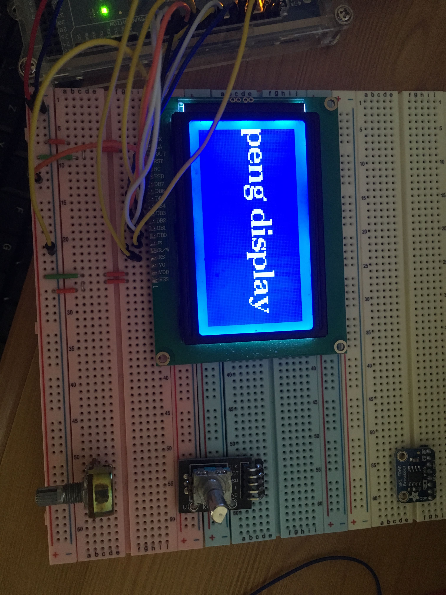

# AthaanClock
I'm creating a device that plays the islamic call to prayer at the exact prayer times.

Currently, I'm using the (rather buggy) ST7290 LCD Display with Arduino Mega2560 and A Keyes rotary encoder to allow the user to configre athaan settings.

Fully configured display:

Using U8G2 arduino library to display functions on LCD on Full screen Buffer.

Configuring rotary encoder in sync with display:

Created a user interface menu for user to interact with functions:

